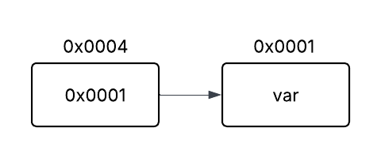

\newpage

# Referência
- Silvio Lago C
    - Pág. 92 a 111

## Ponteiros
- Variável que armazena endereço para um espaço na memória;
- Ou  seja, o ponteiro “aponta” para um espaço memória.
- Ponteiros podem ser atribuídos o valoe _nulo_ (NULL da biblioteca `stdlib.h`)



### Declaração de Ponteiro
```c
        tipo_ptr *nome_ptr; // com asterisco antes do nome
```

### Operadores
- **Operador de endereço** (&): Determina o endereço de uma variável (primeiro _byte_ do bloco ocupado pela variável).
- **Operador de conteúdo** (\*): Dereferencia endereço para exibição do conteúdo naquele local na memória.

### Ponteiro para Função

#### Declaração de Ponteiro de Função
- Utilizando o _operador de endereço_ pode-se atribuir o endereço de uma função para um ponteiro.

```c
        float func(int a, int b) {
            // ...
        }
        
        float (*func_ptr)(int, int); // tipo_r (*nome_p)(lista);
        func_ptr = &func;
        
        float temp = (*func_ptr)(2, 4); // vai para subrotina através de seu endereço
```

\newpage
#### Ponteiro de Função como Parâmetro
```c
        float soma(int a, int b) {
            return a + b;
        }

        float func(..., int a, float (*func_ptr)(int,int), ...) {
            // ...
        }

        func(..., 3, &soma, ...);
```

## Alocação de Memória
