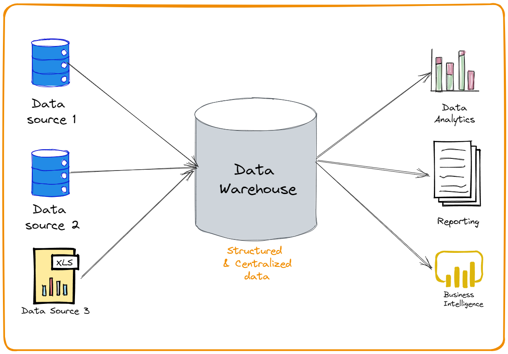

\newpage

# Introdução

## Banco de Dados

### Definição genérica
- Coleção de dados relacionados;
- Fatos conhecidos que podem ser registrados e possuem significado implícito.

### Definição de uso comum
- Aspecto do mundo real, às vezes chamado de _minimundo_ ou de _universo de discurso_.
- As mudanças no _minimundo_ são refletidas no banco de dados;
- Coleção logicamente coerente de dados com algum significado inerente;
- Um banco de dados é _projetado_, _construído_ e _populado_ com dados para uma finalidade específica;
- Possui grupo definido de usuários;
- Possui algumas aplicações previamente concebidas nas quais esses usuários estão interessados.
- Pode ser gerado e mantido manualmente ou pode ser computadorizado:
    - Catálogo de cartão de biblioteca - manualmente gerado/mantido;
- Um banco de dados computadorizado é mantido por um grupo de programas de aplicação escritos especificamente para essa tarefa ou por um _sistema gerenciador de banco de dados_.
- Definir um banco de dados envolve especificar os tipos, estruturas e restrições dos dados a serem armazenados.

### Em outras palavras... banco de dados tem
- Fonte da qual o dado é derivado;
- Grau de interação com eventos no mundo real;
- Público ativamente interessado em seu conteúdo.
- Usuário final faz ações que alteram o _banco de dados_;
- Para que um banco de dados seja preciso e confiável, ele deve refletir o minimundo.

> **_NOTA_:** Uma variedade aleatória de dados não pode ser corretamente chamada de banco de dados!!

### Minimundo ou Universo de Discurso (UoD)
- Delimita o escopo do problema;
- Representa um aspecto do mundo real;
- Coleção logicamente coerente de dados com algum significado inerente;
    - Um banco de dados de uma escola pode ter entidades como _Professor_, _Aluno_, _Disciplina_ mas não pode ter a entidade _Corretor de Móveis_.
- Construído para uma finalidade específica.

### Sistema de Gerenciamento de Banco de Dados (SGBD)
- Coleção de programas que permite um usuário criar e manter bancos de dados;
- MySQL, Oracle, PostgreSQL e outros;
- Um SGBD pode ter mais de um banco de dados/minimundo para dividir o que é utilizado pelas aplicações;
- _Definição_ ou _informação descritiva_ do banco de dados também é armazenada pelo _SGBD_ na forma de um catálogo ou dicionário, chamado de **metadados**.

## Sistemas de Warehousing e Processamento Analítico Online
- Usado para extrair e analisar informações comerciais úteis de bancos de dados _muito grandes_.
- Ajuda na tomada de decisão.
- A tecnologia de _tempo real_ e _banco de dados ativo_ é usada para controlar processos industriais e de manufatura industrial.

### Data Warehouse
> **_NOTA_:** Elaborar depois... Pode cair em prova!!

---

---

# Técnicas de Pesquisa de Bancos de Dados
- NoSQL;
- SQL.

> **_NOTA_:** Elaborar depois...

## Exercício de Elaboração de Minimundo

### Sistema de bilhete rodoviário
- O _minimundo_ consiste em uma rodoviária que tem a necessidade de manter controle do fluxo de veículos, do estado funcional das máquinas (manutenções) e das passagens compradas.
- As passagens compradas devem ser arma pew pew

- Um sistema de controle de estação rodoviária, onde ocorrem vendas de passagens, controle de saídas e entradas de veículos (ônibus), registro de motoristas alocados ao turno, informações do cliente 

- **Tabelas**:
    - Cliente:
        - Identificador do cliente (Chave Primária);
        - Nome do comprador;
        - CPF/Documento regulamentado;
        - Telefone;
        - Forma de pagamento.
    - Passagens:
        - Identificador de Passagem (Chave Primária);
        - Código de trajeto (MAO-RR);
        - Identificador de cliente (Chave Estrangeira);
        - Identificador de veículo (Chave Estrangeira);
        - Preço da passagem.
    - Veículos:
        - Identificador de Veículo (Chave Primária)
        - Data de última manutenção;
        - Data de próxima manutenção;
        - Identificador de motorista (Chave Estrangeira).
    - Motoristas:
        - Identificador de Motorista (Chave Primária);
        - Nome do motorista;
        - CPF/Documento regulamentado;
        - Identificador de Veículo (Chave Estrangeira).

- **Aplicação**:
    - Modo Usuário:
        - Agendar passagem;
        - Cancelar passagem;
        - Editar cadastro;
        - Consula de passagem;
    - Modo Administrador
        - CRUD da passagem;
            - Especificação de preço;
            - Alocação de motoristas;
        - CRUD de veículo;
            - Ligação com o motorista;
        - CRUD de motorista;
            - Turno de atuação;
            - Veículo de atuação.
        - CRUD de viagem;
            - Definir partida/destino;
            - Definir quantidade de passagens;
            - Alocar motorista.
  
  [tipo a ideia de minimundo existe posterio nao sei o nome tipo minimundo eh o problema e o bd eh a solucao ent o certo seria a gnt pensar nessa ativ como ignorante e nao devDEV a gnt eh nerd demaior que a gente ja tem varias ideias, so refinar pra bd especificamente, pq a gent pode fazr algo bobinho e matar rapido e foca no resto uqe for difick]

### Locadora de filmes
