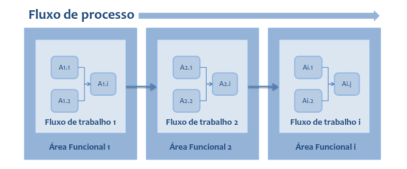

# Desenho de Processos

## Fluxo de Processo
O desenho de processos é a definição formal de objetivos e entregáveis, e a
organização das atividades e regras necessárias para produzir um resultado
desejado.

## Gerenciando o desenho de Processos de Negócio
Devido ao fato de que na maioria das organizações há poucas abordagens formais
para desenho de processos, as equipes ficam abertas para definir a abordagem que
irão utilizar.
