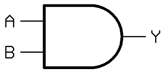

\newpage

# Portas Lógicas

## Lógica Proposicional

### Negação
- Simbolizado pela cantoneira ou $\lnot$

| $p$ | $\lnot p$ |
| :---: | :---: |
| V | F |
| F | V |

### Disjunção
### Disjunção Exclusiva
### Condicional
### Bicondicional
- Só é verdadeiro quando todos forem verdadeiro.

| $p$ | $q$ | $p \rightarrow q$ |
| :---: | :---: | :---: |
| $V$ | $V$ | $V$ |
| $V$ | $F$ | $F$ |
| $F$ | $V$ | $F$ |
| $F$ | $F$ | $V$ |

## Construção de Tabela Verdade

- Exemplo 1: $\lnot (p\rightarrow q)$

| $p$ | $q$ | $p\rightarrow q$ | $\lnot (p\rightarrow q)$ |
| :---: | :---: | :---: | :---: |
| V | V | V | F |
| V | F | F | V |
| F | V | V | F |
| F | F | V | F |

- Exemplo 2: $(A\lor B)\land C$

| $A$ | $B$ | $C$ | $A\lor B$ | $(A\lor B)\land C$ |
| :---: | :---: | :---: | :---: | :---: |
| V | V | V | V | V |
| V | V | F | V | F |
| V | F | V | V | V |
| V | F | F | V | F |
| F | V | V | V | V |
| F | V | F | V | F |
| F | F | V | F | F |
| F | F | F | F | F |

## Por que estudar Portas Lógicas?
- Portas lógicas manipulam sinais elétricos;
- Implementam **Álgebra Booleana**;

### Blocos fundamentais do Hardware
- ULA;
- Registradores;
- Memória;
- Unidade de Controle;
- Todos são construídos com combinações de portas lógicas!!

### Conexão com a Programação
- And (&&);
- Or (||);
- Not (!);
- Operações bit a bit (bitwise operations);
- Cada operador tem implementação física!!

### Componentes eletrônicos
- Circuitos que contém portas lógicas são chamados de *circuitos lógicos*.

### Portas Lógicas
#### Porta AND
- Pode-se dizer que a *Porta AND* simula uma multiplicação binária.

#### Porta OR
#### Porta XOR (Ou Exclusivo)
- Possui como principal função a *verificação de igualdade*.

#### Porta NOT
- Realiza _inversão_ de digito binário.

#### Porta NAND e NOR
- Tais como AND e OR respectivamente mas negadas.
