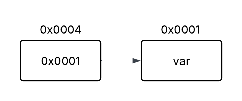

# 1. Referência
- Silvio Lago C
    - Pág. 92 a 111

## 1.1 Ponteiros
- Variável que armazena endereço para um espaço na memória;
- Ou  seja, o ponteiro “aponta” para um espaço memória.
- Ponteiros podem ser atribuídos o valoe _nulo_ (NULL da biblioteca `stdlib.h`)



### 1.1.1 Declaração de Ponteiro
```c
        tipo_ptr *nome_ptr; // com asterisco antes do nome
```

### 1.1.2 Operadores
- **Operador de endereço** (&): Determina o endereço de uma variável (primeiro _byte_ do bloco ocupado pela variável).
- **Operador de conteúdo** (\*): Dereferencia endereço para exibição do conteúdo naquele local na memória.

### 1.1.3 Ponteiro para Função

#### 1.1.3.1 Declaração de Ponteiro de Função
- Utilizando o _operador de endereço_ pode-se atribuir o endereço de uma função para um ponteiro.

```c
        float func(int a, int b) {
            // ...
        }
        
        float (*func_ptr)(int, int); // tipo_r (*nome_p)(lista);
        func_ptr = &func;
        
        float temp = (*func_ptr)(2, 4); // vai para subrotina através de seu endereço
```

\newpage
#### 1.1.3.2 Ponteiro de Função como Parâmetro
```c
        float soma(int a, int b) {
            return a + b;
        }

        float func(..., int a, float (*func_ptr)(int,int), ...) {
            // ...
        }

        func(..., 3, &soma, ...);
```

# 2. Tipo Abstrato Pilhas

## 2.1 Definição
Pilhas é uma estrutura de dados abstrata que é acessível por uma de suas extremidades para armazenar e recuperar dados.

- Uma pilha é chamada de estrutura **LIFO** (last in, first out)
- Pode ser implementada por meio de um vetor (pilha estática) ou por meio de uma lista (pilha dinâmica).
- Operações:
    + limpar pilha;
    + verifica se a pilha está vazia;
    + coloca elemento no topo da pilha;
    + toma o elemento mais alto da pilha;
    + retorna elemento mais alto da pilha sem removê-lo.

# 3. Listas Lineares

## 3.1 Declaração de Estrutura
Uma lista cadeada simples possui o dado a ser armazenado e um ponteiro que referencia o próximo _nó_ da lista. Essencialmente varios "nós" um apontando para o outro onde cada um possui um dado armazenado.
```c
struct Lista {
    float nota;
    struct Lista *prox_nota;
} Lista;
```

## 3.2 Instanciação e Preenchimento
Declara-se primeiro o _nó_ inicial da lista, e atribui-se `NULL` para o ponteiro do proximo nó da lista. Desse modo, ao percorrer toda a lista, sabe-se onde interromper o loop sem acessar memória nula.
```c
// declaracao de uma lista encadeada simples que será vazia a priori
Lista inicio = {0};
inicio.prox_nota = NULL;

// valor temporario que sera armazenado em cada no
float valor;
char resp[16];

// ponteiro que ira percorrer todos os nos
Lista *no_atual = &inicio;

do {
    // aloca memoria para o proximo nodo
    no_atual->prox_nota = malloc(sizeof(Lista));
    printf("digite a nota: ");
    scanf("%f", &valor);
    // atribui o valor digitado ao nodo atual
    no_atual->nota = valor;
    // aponta ponteiro 'no' para o proximo no da lista
    no_atual = no_atual->prox_nota;
    // atribui 'NULL' para o proximo nodo, indicando que o no atual e o ultimo da lista
    no_atual->prox_nota = NULL;

    printf("deseja continuar? (s/n): ");
    getchar();
    fgets(resp, 16, stdin);
} while (*resp == 's' || *resp == 'S');
```

## 3.3 Percorrer Lista
```c
// aponta 'no_atual' para o inicio da lista (primeiro nó)
no_atual = &inicio;

// enquanto proximo nó não for null (ultimo nó da lista), continuar repetição
while (no_atual->prox_nota != NULL) {
    // imprime valor do nó atual
    printf("Nota: %.2f\n", no->nota);
    // aponta 'no_atual' para o proximo nó da lista
    no_atual = no_atual->prox_nota;
}
```
