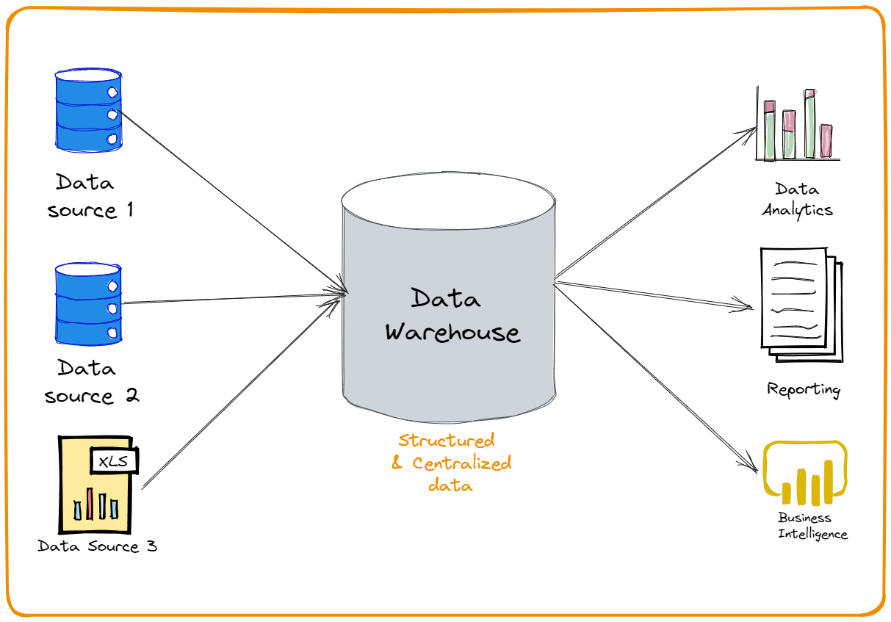

# 1. Projeto de Modelagem Banco de Dados

## 1.1 Ideias
### 1.1.1 _SUI_ - Sistema Unificado Intra departamental
- Departamentos do IFAM interligados por banco de dados relacional, permitindo maior eficiência na troca de informações entre diferentes blocos administrativos da instituição.

### 1.1.2 _Plataforma de compartilhamento de Artes Visuais_. "Conceito inicial do Instagram antes da Facebook".
- A desenvolver...

### 1.1.3 _Aplicação que administra reservas de mesas em um restaurante_ e disponibiliza consulta de cardápios e possíveis reservas.
- Existem duas tabelas principais:
    * Reservas
    * Pratos
- E uma tabela secundária que referencia a tabela `pratos`, apresentando os pratos disponíveis

- Tabela de reservas de mesas de um restaurante:
    * Id. de cliente (chave primária);
    * Nome de cliente;
    * Qtd. de mesas disponíveis;
    * Qtd. de pessoas;
    * Horários disponíveis;
    * Datas disponíveis;
    * Tarifa pela reserva (Calculado na qtd. de pessoas);

- Pratos:
    * Id. do prato (chave);
    * Nome do prato;
    * Preço do prato;

- Cardápio:
    * Id. do Cardápio (chave primária);
    * Id. do prato (chave estrangeira);
    * Id. do prato (chave estrangeira);
    * Id. do prato (chave estrangeira);

- Aplicação:
    * _Modo Cliente_
        * Id. do Cliente (nome);
        * Consulta de reserva;
        * Consulta de cardápio.
    * _Modo Administrador_
        * Criar reservas;
            + Criar um registro na Tabela de Reservas.
        * Atualizar reservas disponíveis;
        * Excluir reservas;
        * Criar cardápio;
        * Criar prato.

# 2. Introdução

## 2.1 Banco de Dados

### 2.1.1 Definição genérica
- Coleção de dados relacionados;
- Fatos conhecidos que podem ser registrados e possuem significado implícito.

### 2.1.2 Definição de uso comum
- Aspecto do mundo real, às vezes chamado de _minimundo_ ou de _universo de discurso_.
- As mudanças no _minimundo_ são refletidas no banco de dados;
- Coleção logicamente coerente de dados com algum significado inerente;
- Um banco de dados é _projetado_, _construído_ e _populado_ com dados para uma finalidade específica;
- Possui grupo definido de usuários;
- Possui algumas aplicações previamente concebidas nas quais esses usuários estão interessados.
- Pode ser gerado e mantido manualmente ou pode ser computadorizado:
    - Catálogo de cartão de biblioteca - manualmente gerado/mantido;
- Um banco de dados computadorizado é mantido por um grupo de programas de aplicação escritos especificamente para essa tarefa ou por um _sistema gerenciador de banco de dados_.
- Definir um banco de dados envolve especificar os tipos, estruturas e restrições dos dados a serem armazenados.

### 2.1.3 Em outras palavras... banco de dados tem
- Fonte da qual o dado é derivado;
- Grau de interação com eventos no mundo real;
- Público ativamente interessado em seu conteúdo.
- Usuário final faz ações que alteram o _banco de dados_;
- Para que um banco de dados seja preciso e confiável, ele deve refletir o minimundo.

> **_NOTA_:** Uma variedade aleatória de dados não pode ser corretamente chamada de banco de dados!!

### 2.1.4 Minimundo ou Universo de Discurso (UoD)
- Delimita o escopo do problema;
- Representa um aspecto do mundo real;
- Coleção logicamente coerente de dados com algum significado inerente;
    - Um banco de dados de uma escola pode ter entidades como _Professor_, _Aluno_, _Disciplina_ mas não pode ter a entidade _Corretor de Móveis_.
- Construído para uma finalidade específica.

### 2.1.5 Sistema de Gerenciamento de Banco de Dados (SGBD)
- Coleção de programas que permite um usuário criar e manter bancos de dados;
- MySQL, Oracle, PostgreSQL e outros;
- Um SGBD pode ter mais de um banco de dados/minimundo para dividir o que é utilizado pelas aplicações;
- _Definição_ ou _informação descritiva_ do banco de dados também é armazenada pelo _SGBD_ na forma de um catálogo ou dicionário, chamado de **metadados**.

## 2.2 Sistemas de Warehousing e Processamento Analítico Online
- Usado para extrair e analisar informações comerciais úteis de bancos de dados _muito grandes_.
- Ajuda na tomada de decisão.
- A tecnologia de _tempo real_ e _banco de dados ativo_ é usada para controlar processos industriais e de manufatura industrial.

### 2.2.1 Data Warehouse
> **_NOTA_:** Elaborar depois... Pode cair em prova!!

---

---

# 3. Técnicas de Pesquisa de Bancos de Dados
- NoSQL;
- SQL.

> **_NOTA_:** Elaborar depois...

## 3.1 Exercício de Elaboração de Minimundo

### 3.1.1 Sistema de bilhete rodoviário
- O _minimundo_ consiste em uma rodoviária que tem a necessidade de manter controle do fluxo de veículos, do estado funcional das máquinas (manutenções) e das passagens compradas.
- As passagens compradas devem ser arma pew pew

- Um sistema de controle de estação rodoviária, onde ocorrem vendas de passagens, controle de saídas e entradas de veículos (ônibus), registro de motoristas alocados ao turno, informações do cliente 

- **Tabelas**:
    - Cliente:
        - Identificador do cliente (Chave Primária);
        - Nome do comprador;
        - CPF/Documento regulamentado;
        - Telefone;
        - Forma de pagamento.
    - Passagens:
        - Identificador de Passagem (Chave Primária);
        - Código de trajeto (MAO-RR);
        - Identificador de cliente (Chave Estrangeira);
        - Identificador de veículo (Chave Estrangeira);
        - Preço da passagem.
    - Veículos:
        - Identificador de Veículo (Chave Primária)
        - Data de última manutenção;
        - Data de próxima manutenção;
        - Identificador de motorista (Chave Estrangeira).
    - Motoristas:
        - Identificador de Motorista (Chave Primária);
        - Nome do motorista;
        - CPF/Documento regulamentado;
        - Identificador de Veículo (Chave Estrangeira).

- **Aplicação**:
    - Modo Usuário:
        - Agendar passagem;
        - Cancelar passagem;
        - Editar cadastro;
        - Consula de passagem;
    - Modo Administrador
        - CRUD da passagem;
            - Especificação de preço;
            - Alocação de motoristas;
        - CRUD de veículo;
            - Ligação com o motorista;
        - CRUD de motorista;
            - Turno de atuação;
            - Veículo de atuação.
        - CRUD de viagem;
            - Definir partida/destino;
            - Definir quantidade de passagens;
            - Alocar motorista.
  
  [tipo a ideia de minimundo existe posterio nao sei o nome tipo minimundo eh o problema e o bd eh a solucao ent o certo seria a gnt pensar nessa ativ como ignorante e nao devDEV a gnt eh nerd demaior que a gente ja tem varias ideias, so refinar pra bd especificamente, pq a gent pode fazr algo bobinho e matar rapido e foca no resto uqe for difick]

# 4. Sistema Gerenciamento de Banco de Dados
> Também encurtado para _SGBD_.

- **Coleção de programas** que permite aos usuários criar e manter um banco de dados.
- Facilita o processo de definição, construção, manipulação e compartilhamento de banco de dados.
- _Definir_ um banco de dados envolve especificar os tipos, **estruturas** e **restrições** dos dados a serem armazenados.

> **Exemplos**: MySQL, DB2, SQL Server, PostgreSQL, Oracle, MariaDB, etc.

## 4.1 Definição ou Informação Descritiva
- Armazenada pelo _SGDB_ na forma de um catálogo ou dicionário chamado de **metadados**.
- A construção de um banco de dados é o processo de armazenar os dados em algum meio controlado pelo SGDB.
- A **manipulação** de um banco de dados inclui funções como **consulta** ao banco de dados para recuperar dados específicos, **atualização** para refletir mudanças no  minimundo e *geração de relatórios* com base nos dados.
    - **CRUD**: CREATE, REQUEST, UPDATE, DELETE.

> Atualizar um banco de dados é executar funções CRUD!! Segundo abílio-chwan.

## 4.2 Compartilhamento de um Banco de Dados
- Permite que diversos usuários e programas acessem o banco de dados simultaneamente.
- Programa de Aplicação acessa o banco de dados ao enviar consultas ou solicitações de dados ao SGBD.
- **Consulta**: Normalmente resulta na recuperação de alguns dados.
- **Transação**: Pode fazer com que alguns dados sejam lidos e outros, gravados.

### 4.2.1 Servidor de Aplicação
- Onde está o website que será utilizado pelo usuário.

## 4.3 Proteção
- Defeitos de hardware ou software
- Sistema contra malwares,

## 4.4 Ferramentas
- HeidiSQL
