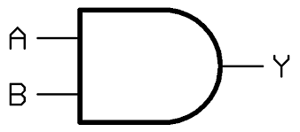

# 1. Sistemas Numéricos

## 1.1 Posicionais
- Independentemente da posição em que são escritos, se mantém o significado.
- Exemplo: Algarismo romanos
$$XXI = 10, 10, 1 \quad e \quad XIX = 10, 1, 10$$

## 1.2 Não-Posicinais
- Valor do algarismo depende de sua posição, ou seja, ordem em que é escrita.
- Exemplo: Sistema numérico indo-arábico
$$21 = 20 + 1 \quad e \quad 12 = 10 + 2$$

## 1.3 Bases dos Sistemas de Numeração
- Quantidade de algarismos que compõe um sistema de numeração;
- Sistema decimal, adotado pelo ocidente, possui dez algarismos, portanto, é denominado _sistema decimal_.

> **_NOTE:_**  The note content.

# 2. Portas Lógicas

## 2.1 Lógica Proposicional

### 2.1.1 Negação
- Simbolizado pela cantoneira ou $\lnot$

| $p$ | $\lnot p$ |
| :---: | :---: |
| V | F |
| F | V |

### 2.1.2 Disjunção
### 2.1.3 Disjunção Exclusiva
### 2.1.4 Condicional
### 2.1.5 Bicondicional
- Só é verdadeiro quando todos forem verdadeiro.

| $p$ | $q$ | $p \rightarrow q$ |
| :---: | :---: | :---: |
| $V$ | $V$ | $V$ |
| $V$ | $F$ | $F$ |
| $F$ | $V$ | $F$ |
| $F$ | $F$ | $V$ |

## 2.2 Construção de Tabela Verdade

- Exemplo 1: $\lnot (p\rightarrow q)$

| $p$ | $q$ | $p\rightarrow q$ | $\lnot (p\rightarrow q)$ |
| :---: | :---: | :---: | :---: |
| V | V | V | F |
| V | F | F | V |
| F | V | V | F |
| F | F | V | F |

- Exemplo 2: $(A\lor B)\land C$

| $A$ | $B$ | $C$ | $A\lor B$ | $(A\lor B)\land C$ |
| :---: | :---: | :---: | :---: | :---: |
| V | V | V | V | V |
| V | V | F | V | F |
| V | F | V | V | V |
| V | F | F | V | F |
| F | V | V | V | V |
| F | V | F | V | F |
| F | F | V | F | F |
| F | F | F | F | F |

## 2.3 Por que estudar Portas Lógicas?
- Portas lógicas manipulam sinais elétricos;
- Implementam **Álgebra Booleana**;

### 2.3.1 Blocos fundamentais do Hardware
- ULA;
- Registradores;
- Memória;
- Unidade de Controle;
- Todos são construídos com combinações de portas lógicas!!

### 2.3.4 Conexão com a Programação
- And (&&);
- Or (||);
- Not (!);
- Operações bit a bit (bitwise operations);
- Cada operador tem implementação física!!

### 2.3.5 Componentes eletrônicos
- Circuitos que contém portas lógicas são chamados de *circuitos lógicos*.

### 2.4 Portas Lógicas
#### 2.4.1 Porta AND
- Pode-se dizer que a *Porta AND* simula uma multiplicação binária.



#### 2.4.2 Porta OR
#### 2.4.3 Porta XOR (Ou Exclusivo)
- Possui como principal função a *verificação de igualdade*.

#### 2.4.4 Porta NOT
- Realiza _inversão_ de digito binário.

#### 2.4.5 Porta NAND e NOR
- Tais como AND e OR respectivamente mas negadas.

# 3. Ciclo de Instrução e Interrupção

## 3.1 Instruções
- 0001 (0x1): Carrega AC da memória
- 0010 (0x2): Armazena AC na memória
- 0101 (0x5): Adiciona ao AC da memória

- 0011 (0x3): Carregar AC de E/S
- 0111 (0x7): Armazenar AC em E/S

Nesse caso, o endereço de 12 bits identifica um dispositivo de E/S em particular.
Mostre a execução do programa a seguir:

## 3.2 Execução
1. Carregar AC do dispositivo 5
2. Somar do conteúdo do local de memória 940
3. Armazenar AC no dispositivo 6

<div style="text-align: right">---</div>

```c
300: 0x3005
301: 0x5940
302: 0x7006
...
940: 0x0002
```

<div style="text-align: right">---</div>

```asm
; CICLO 1
PC: 300
IR: 0x3005
AC: 0x0003
D5: 0x0003
D6: -
```

<div style="text-align: right">---</div>

```asm
; CICLO 2
PC: 301
IR: 0x5940
AC: 0x0005
D5: 0x0003
D6: -
```

<div style="text-align: right">---</div>
\newpage

```asm
; CICLO 2
PC: 302
IR: 0x7006
AC: 0x0005
D5: 0x0003
D6: 0x0005
```

- Suponha que o próximo valor apanhado do dispositivo 5 seja 3 e que o local
